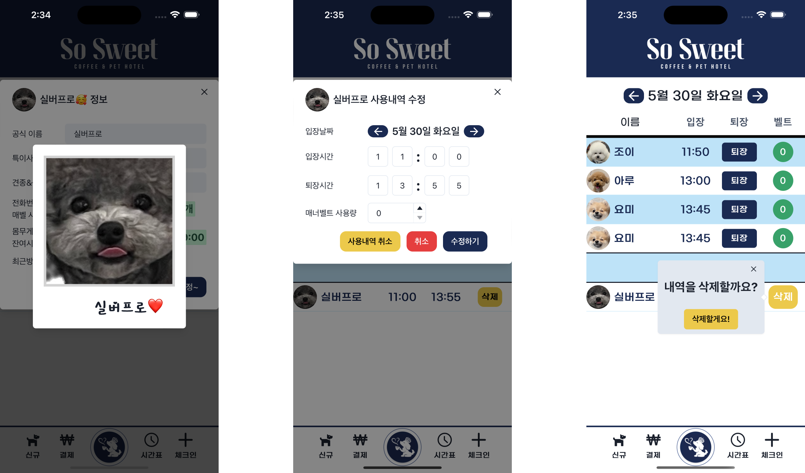
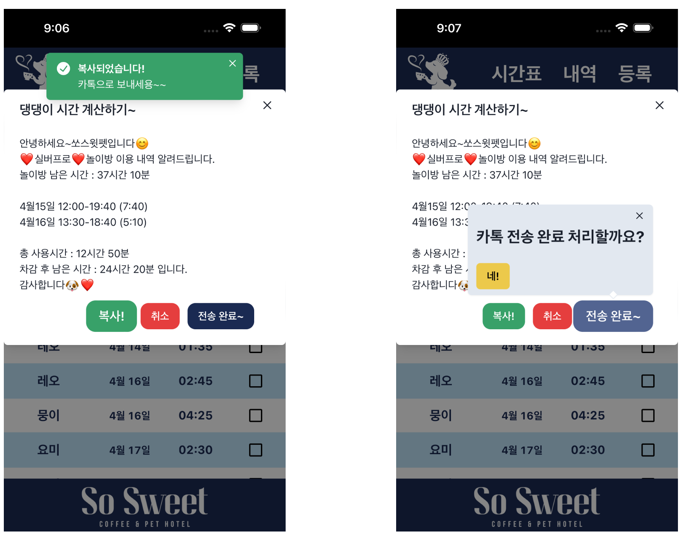

# 쏘스윗 매니저 Tech Spec.

  

[쏘스윗 펫 카페&호텔](https://www.instagram.com/sosweet_coffee_pet_hotel/)에서 강아지들의 놀이방 사용을 관리하기 위한 모바일 기반의 웹 페이지에요.

## Tech Stacks
- 코어 : React, Python
- 상태 관리 : Redux, React-query
- 스타일링 : Chakra UI
- 백엔드 : FastAPI, CloudflareAPI
- 데이터베이스 : MariaDB

## 정당성

- 쏘스윗 애견 카페 사장님의 기존 업무 방식은 모든 기록을 수기로 작성하고 관리하셨어요. 하지만 관리해야 할 것들이 많고 복잡하여 실수가 잦고, 
업무에 대한 피로가 높으셨어요. 결제 내역, 출입 기록, 이용 내역, 잔여 시간등을 기록하셨어요.
- 이 어려움을 해결하기 위해 저는 구글 스프레드 시트를 제작하여 2022년 6월부터 사용하여 해결할 수 있었어요.
  하지만 이 또한 여러가지 문제가 발생하여 아예 새로운 프로젝트로 진행하기로 생각했어요.

 

구글 스프레드 시트에서 발생한 문제

### 기존의 쏘스윗 매니저의 한계

### 스프레드 시트 설계

- 스프레드 시트에서 HH:MM 형식의 Duration을 다루려면 빌트인으로 제공되는 형식과 함수로는 사용이 불가하여, 이에 관한 함수를 사용자 작성 함수(script)로 개발하여 적용
- 고객에게 보낼 사용 내역 메세지를 자동으로 생성하여 주는 코드(IPython, Google Colaboratory) 개발
- 연두색은 사용자의 입력이 허용되는 부분, 분홍색은 입력이 허용되지 않는 부분으로 사용자의 입력에 대한 계산 결과값을 보여주는 부분.
- 2022년 6월 개발 완료 후 사용 시작

기존의 쏘스윗 매니저 보기

#### 개발 내역

#### 월별 사용 시트

#### 시간 계산기

#### 데이터베이스 시트

#### 사용 시간 시트

#### 남은 시간 시트

#### 결제 내역

### 이슈 사항

- Custom 함수를 적용한 부분들이 작동하지 않으면서 연쇄적으로 다른 곳까지 영향을 미치기 시작함.
- Loading… 으로 표기되며 사용자 작성 함수(script)의 실행 결과를 기다리고 있으나, 구글의 스크립트 서버에서 실행에 대한 요청이 누락되어 결과를 얻지 못 함.
- 사용 시간(분)에 종속된 셀들이 'Loading….'을 받아 NaN(Not a Number)를 나타내어 다른 곳에 영향을 미침

## 기능

- 강아지 정보 등록
- 강아지 프로필 사진 등록
- 날짜별 체크인, 체크아웃 시간 기록
- 애견용 기저귀 사용량 기록
- 이용 내역 확인 및 수정
- 견주에게 전송할 이용 내역, 잔여 시간 안내 메시지 생성
- 결제 내역 기록 및 관리
- 강아지 목록과 특징, 견주 정보 등 등록 정보 확인

## 일정

- 2023\. 03. 27 - 개발 시작
- 2023\. 04. 10 - Data Migration
- 2023\. 04. 13 - 프로토 타입 출시, 실 사용 시작
- 2023\. 04. 21 - 호텔링 기능 추가 설계
- 2023\. 04. 25 - 1차 디자인 업데이트 - Home, Header, Footer
- 2023\. 05. 01 - 프로필 사진 업로드 업데이트

## Database Schema

기능 정의

### > 0. 남은 시간

- 기존에 사용하던 스프레드 시트에서 이관해온 잔여 시간 데이터

### > 1. 강아지 등록 정보

- 이름
- 견종
- 특이사항
- 성별
- 견주 전화번호
- 몸무게
- 사용 내역 메세지 생성에 사용될 강아지 이름
- 삭제 여부
- 프로필 사진 API ID

### > 2. 결제 내역

- 이름
- 결제시간(분)
- 결제일
- 삭제 여부

### > 3. 시간표

- 이름
- 체크인 시간
- 체크아웃 시간
- 이용 날짜
- 기저귀 사용량
- 삭제 여부

### > 4. 사용 내역

- 이름
- 이용 날짜
- 이용 시간
- 기저귀 사용량
- 고객에게 사용 내역 메세지 전송 여부
- 체크인 시간
- 체크아웃 시간
- 메세지 전송일
- 기저귀 결제 여부
- 삭제 여부

## Product View

Live Version (2023. 04. 25 ~ Current)

### 홈화면

### 당겨서 새로고침

### 시간표

### 강아지 목록

### 놀이방 이용 내역 전송

### 메세지 예시

### 강아지 등록 정보 수정

### 결제 내역

.png)

### 놀이방 이용 내역

Prototype (2023. 04. 13 ~ 2023. 04. 25)

### 1. 시간표

### 2. 내역

### 2-1. 이용시간 계산

### 2-2. 이용 내역

### 2-3. 결제 내역

### 2-4. 댕댕이 목록

